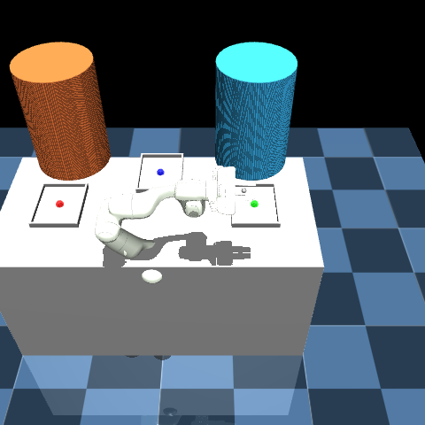

# Surgical Tray Management Environment

A custom Reinforcement Learning (RL) simulation environment built using **MuJoCo** and **Gymnasium-Robotics**, designed to solve dynamic surgical instrument handling workflows. This project evaluates a **Franka Emika Panda** robot arm executing multi-step sequences to deliver, clean, and store surgical instruments (`scalpel`, `grasper`, `scissors`) under sterile constraints.



## Features
- **Custom MuJoCo Physics (MJCF):** A fully engineered 3D operating room containing three specific trays (Storage, Surgeon, Cleaning) and a 7-DOF Panda manipulator with a 2-DOF parallel-jaw gripper.
- **Human-Robot Interaction (HRI) Modeling:** Physically simulated obstacles for the Surgeon and Assistant. The environment incorporates an explicit `IN_USE` state machine that teleports tools into the Surgeon's hands to accurately simulate task unavailability.
- **Dynamic Workflow Paths:**
   - `Path 1`: Direct Tool Exchange (Storage → Surgeon → Storage)
   - `Path 2`: Sterile Processing (Storage → Surgeon → Cleaning → Storage)
- **Soft Actor-Critic (SAC):** Leverages `stable-baselines3` to train highly efficient continuous control policies guided by carefully tuned dense reward shaping (approach, grasp, delivery, and safety penalties).

## Installation
1. Clone the repository and navigate into it.
2. Create and activate a Python virtual environment:
   ```bash
   python -m venv venv
   source venv/bin/activate
   ```
3. Install the dependencies:
   ```bash
   pip install gymnasium gymnasium-robotics stable-baselines3[extra] mujoco imageio tensorboard
   ```

## Usage

### 1. Training the Agent
To start the 1,000,000 timestep Soft Actor-Critic (SAC) training loop:
```bash
python train_baseline.py
```
You can monitor the training progress via Tensorboard:
```bash
tensorboard --logdir ./tensorboard_logs/
```

### 2. Testing the Environment
To verify the kinematics, random action sampling, and state machine tracking without training:
```bash
python test_env.py
```

### 3. Rendering the Model
To load the trained `.zip` model back into the simulator and generate a `visual_representation.gif` of its deterministic policy:
```bash
python render_env.py
```

### 4. Interactive 3D Viewer
To manually inspect the meshes, joint limits, and tray boundaries interactively:
```bash
python -m mujoco.viewer --mjcf surgical_env.xml
```

## State Machine Logistics
The custom environment enforces sequencing via a built-in state tracker for each object:
* `IN_STORAGE`: Located on Tray 1.
* `AT_SURGEON`: Placed on Tray 2 by the Panda arm.
* `IN_USE`: Temporarily unavailable (Surgeon is actively using it).
* `AT_SURGEON_USED`: Returned to Tray 2 by the Surgeon.
* `IN_CLEANING`: Sent to Tray 3 for sterile processing.
* `DONE`: Successfully returned to Storage.

## License
This project is open for research and educational use. Add a license file to specify terms.
